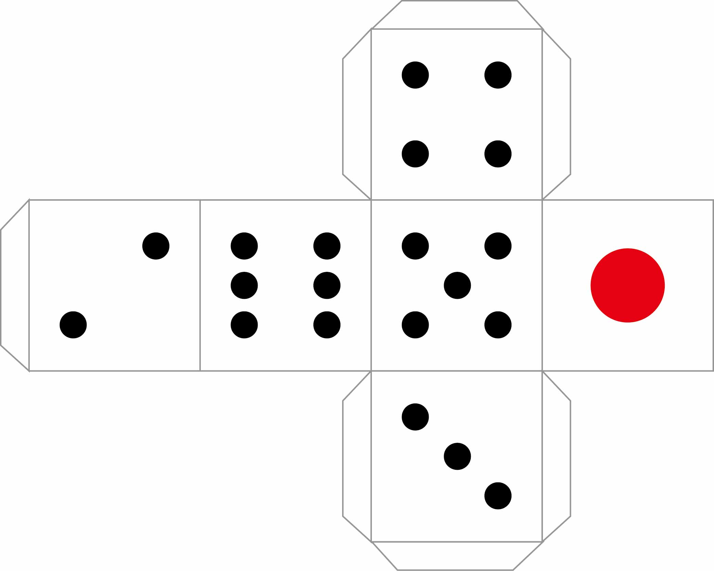

Level1 サイコロの裏面
=============================================

問題
-----------------------
6面サイコロの展開図は以下のようになります。

この図からわかるように，6面サイコロのある目とその裏側にある目（1と6，2と5，3と4）の和は必ず7になります。

この6面サイコロの目を表す整数 n に対し，その裏側にある目を出力してください。

回答方法
----
Level1.php内のexecute内を修正してください。

echoを使い答えが画面に出力するように作成してください。

引数numには1~6の整数が渡されます。
